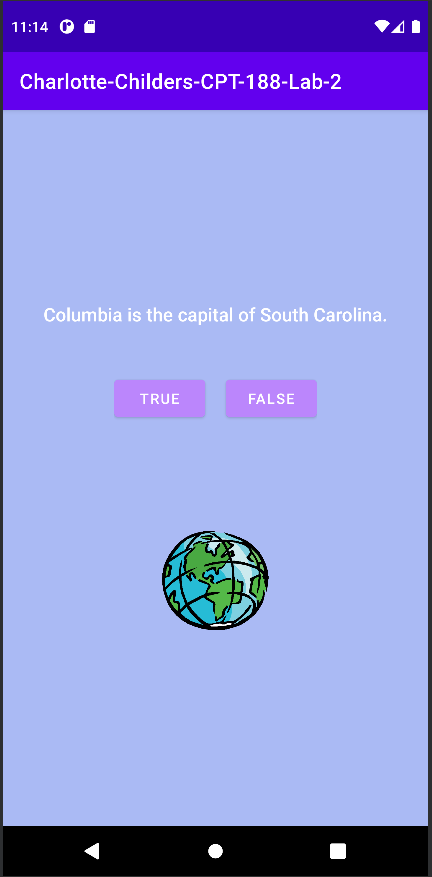

# CPT-188 Lab Two
## *Charlotte Childers*

This project follows along with the GeoQuiz application
created in Chapter one with the additional challenge of:

> For this challenge, customize the toast to show at the top instead of the bottom of the screen. To change how the toast is displayed, use the Toast class’s setGravity function. Use Gravity.TOP for the gravity value.

Unfortunately Apps targeting API level `Build.VERSION_CODES#R` (API Level 30) or higher will not be able to use this method.

The code I used will work in older versions `ex. API(29) / Build.VERSION_CODES#Q`.

```kotlin
trueBtn.setOnClickListener{view:View ->
            val toast = Toast.makeText(
             this,
             R.string.correct_toast,
             Toast.LENGTH_SHORT
         )
            toast.setGravity(Gravity.TOP, 0, 0)
            toast.show()
        }
//This was done respectively for each button.
```

- [Links to Toast Documentation](https://developer.android.com/reference/kotlin/android/widget/Toast#setgravity)
- [Links to OS/Build Versioning](https://developer.android.com/reference/kotlin/android/os/Build.VERSION_CODES.html#R:kotlin.Int)

## Example of the Application



---
- `data class Question.kt` was added preemptively in preparation for the next lab; this addition does not interfere with
  the app's ability to run "as is".